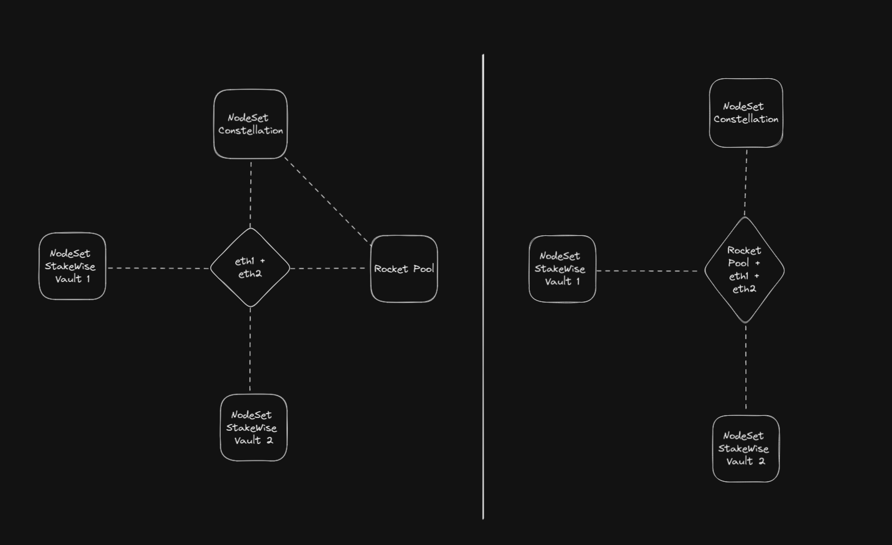

# Overview

**The Problem**

To be maximally trustless, Rocket Pool requires node operators to post a bond for each validator. This restricts growth by requiring a constant supply of NOs who can afford this bond and leads to an uneven distribution of assets across nodes.

**The Solution**

Constellation liquidizes the NO bond, opening it up to external investors via tokens called xrETH and xRPL. The ETH and RPL deposits used to mint these tokens are used by the Constellation smart contracts to create new minipools on Rocket Pool which are operated non-custodially by NodeSet operators.

<figure><figcaption>
Constellation + Rocket Pool Architecture (simplified)
</figcaption></figure>

There are three main roles for participants in this system:

1\) Depositors ([xrETH](xreth.md) or [xRPL](xrpl.md) holders)\
2\) Node operators\
3\) Administrator

<figure><figcaption>
Constellation Internal Architecture (simplified)
</figcaption></figure>

## Current status 

**Constellation is approaching its release! Stay tuned for audit and testnet information.**

## Depositors 

Constellation depositors will operate very similarly to their existing role within the base Rocket Pool protocol, except Constellation will also allow RPL deposits alongside ETH. In both of these cases, depositors will exchange their assets for a fully liquid receipt token which accrues gas-optimized rewards using the same c-token model used by rETH. We call these tokens xrETH and xRPL since Constellation extends the capabilities of the core RP protocol.

**xrETH is a liquid Ether staking token with a 0% commission**. It is functionally very similar to rETH, but it offers the extra advantage of returning the full ETH staking APR, just like solo staking.

**xRPL is an RPL liquid staking token**, which grows in value against RPL based on Rocket Pool’s native RPL emissions.

## Node Operators 

The rewards for xrETH and xRPL comes from the base Rocket Pool protocol, thanks to NOs who opt-in to Constellation. This process is expected to be simple and mostly automated: register with the NodeSet network, download and install an extension to Rocket Pool’s smartnode CLI, run validators, then earn rewards! To ensure depositors receive 100% of ETH staking rewards, NO compensation flows from the rETH commission.

Behind the scenes, NodeSet’s node operator software will create and exit minipools as required using depositors’ ETH with no input needed from the NO. They just need to maintain a Rocket Pool node as usual to get rewarded by Constellation.

However, to fuel the continual creation of new validators in a non-custodial manner, NOs will need to pay initialization gas costs. To understand the full flow, let’s go over the details of minipool creation for Constellation in detail.

**Minipool Creation**

1. NO deploys a node contract and sets the Constellation contract as its withdrawal address.
2. NO deploys a minipool for that node.
3. NO makes a request for Constellation to stake assets into their new minipool. This requires an (encrypted) pre-signed exit message for the validator to be sent to and subsequently approved by Constellation’s admin.
4. If the minipool is validated and approved, the necessary ETH and RPL will be staked by Constellation into that minipool.
5. This process can be repeated to make as many minipools as allowed by the protocol.

NOs always have an incentive to run as many minipools as allowed by Constellation because they are paid for each minipool they run.

## Administrator 

To achieve our decentralization goals, Constellation must distribute ETH as thinly and evenly as possible across as large a set of NOs who have a low barrier to entry. Generally, if someone has been validating on RP with a high effectiveness rating, they should expect to be able to join and receive rewards with very little effort involved. However, even though NOs can’t access depositor funds, a broadly open NO set requires safeguards to ensure NOs are accountable to depositors. This is where the administrator comes in.

The administrator is responsible for keeping the system stable and is incentivized to do so via a portion of the rETH commission earned by the protocol (minus the NO share). To fulfill its duty, the administrator can adjust parameters like commission rates and Deposit Pool size, and most importantly, they are responsible for growing and maintaining the Node Operator set.

There is technology in development which will likely allow the administrator role to be fully automated via on-chain mechanisms in the future, such as ZK-ID services and CL/EL communication within Ethereum, but for now this role contains some manual steps. We’re still determining the exact incarnation of the administrator, but as developers, we can articulate some minimum details already. At launch, the administrator will take the form of an off-chain entity, and although the smart contracts will necessarily leave the exact procedures for admitting and kicking NOs to the administrator’s discretion, we expect it will look something like this:

**Admittance Procedure**

1. NO registers their intention to participate with the administrator. This includes proof of ownership of an existing RP node via a signed message from its address.
2. Automatic checks for provided node address are completed, e.g. all minipools on the node must have an appropriate effectiveness level, etc.
3. NO passes a simple sybil check with the administrator, including a short video interview.

**Kick Conditions**

* Node is offline for too long
* Any minipool on the node is slashed

In extreme cases of NO negligence, the administrator can eject an operator and recover any funds assigned to their node via the stored exit messages. Realistically, we expect that there will be rare or no use of this power and that its existence is both an effective deterrent against NO mismanagement and an effective incentive for operators to behave honestly.

It’s also important to note that, like NOs, the administrator has no access to depositor funds, and they only get rewarded by the continuous, stable operation of the protocol. In general, the administrator is conceived as a highly limited role with very serious restrictions on its behavior so as to preserve the integrity of the protocol, including delays in parameter changes and operator on/offboarding. It’s crucial that the administrator role is under severe restrictions to minimize trust for this role until it can be fully removed. As it stands, depositors will have minimal trust assumptions for the administrator, and node operators should only need to trust the administrator will effectively perform sybil checks to keep rewards fair.

## FAQ 

**Since xrETH has better returns, could it replace rETH?**

We view xrETH as an accelerator and extension to the core Rocket Pool protocol because without sufficient rETH demand, xrETH can’t exist. In fact, due to the improving capital efficiency of RP with low-ETH-bonded minipools, it’s mathematically impossible for xrETH to achieve greater liquidity depth/TVL than rETH.

However, there are several potential solutions we’re considering in case growth of both systems stalls due to higher demand for xrETH than rETH. For example, one of the simplest is capping the xrETH deposit pool to prevent the protocol from growing any further. This is still an active area of research, but we are committed to being good actors in our ecosystem, even if that means placing limitations on Constellation’s growth.

**Will Constellation have a governance token?**

There are no plans for a governance token. Constellation is an extension of Rocket Pool and a prelude to building out a wider NodeSet network of opportunity for NOs — it is not a wholly separate protocol with complex governance needs. Generally, we respect the “ungovernance” principle that projects like [Liquity](https://www.liquity.org/) and [Reflexer](https://reflexer.finance/) model for the same reasons that [Vitalik enunciates well here](https://vitalik.ca/general/2021/08/16/voting3.html). As mentioned above, we hope to eventually fully automate and ossify Constellation, and building up governance in the meantime is counterproductive to this goal.

**Why can’t we just add this to Rocket Pool itself?**

This original concept was studied during Rocket Pool’s development, and back then, it was called nETH. However, the lack of sybil-resistance and other tools to combat NO malfeasance prevented the idea’s viability. Put another way, the available tools were incompatible with full permissionless-ness, so Rocket Pool abandoned the idea.

Constellation, however, as a distinct project built on top of the fully permissionless base protocol, has more flexibility to relax permissioning standards and delegate NO onboarding to an independent administrator to perform the required sybil checks. Thus, the tradeoffs for depositors become more clear: if one believes the administrator and NO’s incentive alignment is sufficient, Constellation will offer higher returns via xrETH, and if one disagrees, then rETH is the appropriate token. Either way, since it’s built on top instead of included with the core protocol, if Constellation malfunctions, Rocket Pool’s sublight engines still work just fine.

**What happens to all the new RPL voting power in Constellation?**

Rocket Pool governance is structured so that NOs will simply have more individual voting power if they are a part of Constellation because they will have more RPL staked. As usual, if NOs wish to delegate their Constellation node’s voting power to another address, they may do so. We encourage NOs to delegate to the administrator so that xrETH and xRPL depositors’ interests are represented, but this is optional.

**How does the xrETH price feed work? Is there an oracle?**

Although we can rely on the base protocol to track xRPL price data, xrETH is more challenging. After [EIP-4788](https://eips.ethereum.org/EIPS/eip-4788) goes live with the Deneb Ethereum upgrade, several potential solutions are available. Until then, however, our only option is to use a crypto-economically secured oracle mechanism, which we’ll detail in a future article.

A historical state proof system is likely to be the ultimate solution, but this represents additional engineering challenges. Tooling is improving quickly, though, and we expect to transition to this model as soon as possible.

This topic is already the subject of wider research, as this is essentially the same problem that the oDAO represents for Rocket Pool. RP’s trusted DAO committee is a potential solution for us as well, though undesirable for many of the same reasons.

**What if the administrator does bad stuff?**

There is a whole category of attacks against Constellation by the administrator which we have termed “Bad Admin” attacks. This includes subcategories like “Evil Admin” attacks and “Incompetent Admin” scenarios, for example. These are all the subject of ongoing security research, but there are several ways to design Constellation to avoid any risk of administrator malfeasance. For example:

* Parameter changes and contract upgrades will have a substantial delay so that depositors or NOs can leave the system before they take effect if they disagree
* Rate-limits may be applied to the removal of NOs so that the administrator can’t take over the network without depositors leaving first

As part of the development process, we’re conducting several security analyses, and once this is further along, we’ll open this research up to the public for further review and contribution. In addition to standard security audits from top-tier firms, we will rely on community review and participation in our public beta to ensure safety.

**What does the administrator look like? Is it one person/entity?**

At the moment, we can’t say for sure what the administrator will look like for launch, but we know that its ideal form is a smart contract. This won’t be possible initially, so we anticipate a multi-sig will manually perform the admin duties. The exact make-up of this group depends on a number of factors which we’re still researching.

**How much work has been done so far? Wen launch?!**

Most of the important pre-development research and design work has already been completed, and smart contract development began a few months ago. We estimate that we’re about 50% through this process, but there is a significant amount of off-chain development needed as well. Software development is notoriously difficult to predict, and we have the same growing pains that every startup experiences with fundraising, hiring, and in this industry, the necessary complication of audits. All of this impacts the timeline, so we can’t give a very specific estimate at the moment.

All of that said, **we hope to launch Constellation early in 2024!**
